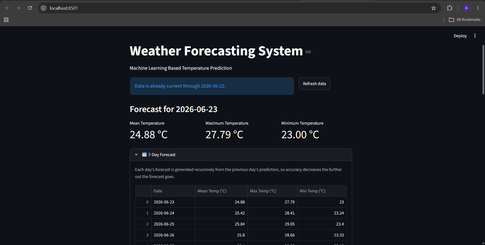
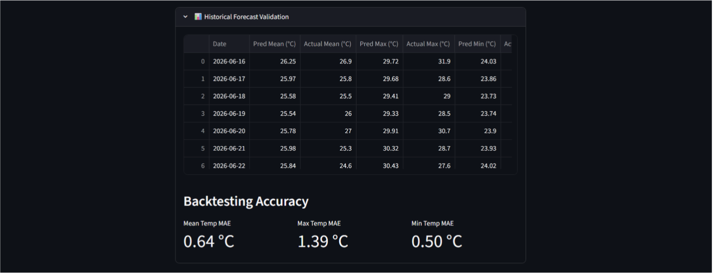
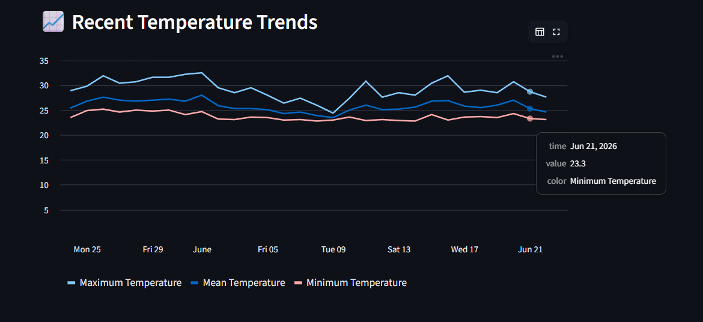

# Weather Forecasting System

## Overview

A Machine Learning-based Weather Forecasting System developed using Python and Streamlit.

The system automatically fetches the latest weather data for Palakkad, Kerala using the Open-Meteo API, updates the dataset, retrains forecasting models, and predicts future temperatures.

The application predicts:

* Mean Temperature
* Maximum Temperature
* Minimum Temperature

for the next 7 days and provides historical backtesting to evaluate model performance.

---

## Features

* Automatic weather data updates using Open-Meteo API
* Mean, Maximum, and Minimum temperature prediction
* Recursive 7-day weather forecasting
* Historical forecast validation (Backtesting)
* Interactive Streamlit dashboard
* Temperature trend visualization
* Automatic model loading using Joblib
* Refresh weather data directly from the web interface

---

## Tech Stack

* Python
* Pandas
* NumPy
* Scikit-Learn
* Streamlit
* Joblib

---

## Project Structure

```text
weather-forecasting-system/
│
├── app.py                     # Streamlit dashboard
├── train_multi.py            # Train mean/max/min models
├── forecast_utils.py         # Recursive forecasting logic
├── update_data.py            # Fetch latest weather data
├── predict.py                # Single-day prediction script
├── requirements.txt
│
├── data/
│   └── Palakkad data1.csv
│
├── models/
│   ├── temperature_model.pkl
│   ├── max_temperature_model.pkl
│   ├── min_temperature_model.pkl
│   └── feature_names.pkl
│
└── README.md
```

---

## Installation

Clone the repository:

```bash
git clone https://github.com/Arjun-116/weather-forecasting-system.git
cd weather-forecasting-system
```

Install dependencies:

```bash
pip install -r requirements.txt
```

---

## Training the Models

Train all models:

```bash
py train_multi.py
```

This creates:

* temperature_model.pkl
* max_temperature_model.pkl
* min_temperature_model.pkl
* feature_names.pkl

---

## Running the Application

Start the Streamlit application:

```bash
py -m streamlit run app.py
```

Open:

```text
http://localhost:8501
```

in your browser.

---

## Model Performance

### Test Set Performance

| Model               | MAE      | RMSE     |
| ------------------- | -------- | -------- |
| Mean Temperature    | ~0.48 °C | ~0.61 °C |
| Maximum Temperature | ~0.89 °C | ~1.16 °C |
| Minimum Temperature | ~0.39 °C | ~0.52 °C |

### Backtesting Performance

| Forecast            | MAE      |
| ------------------- | -------- |
| Mean Temperature    | ~0.64 °C |
| Maximum Temperature | ~1.39 °C |
| Minimum Temperature | ~0.50 °C |

---

## Dashboard Features

* Tomorrow's weather forecast
* 7-day recursive forecast
* Historical forecast validation
* Backtesting accuracy metrics
* Recent temperature trends
* Latest weather records


## Dashboard Screenshots

### Main Dashboard

(screenshots/dashboard2.png)

### Historical Forecast Validation



### Temperature Trends



---

## Future Improvements

* Add humidity prediction
* Add rainfall prediction
* Use advanced models such as Random Forest or XGBoost
* Deploy the application online
* Support forecasting for multiple locations

---

## Author

**Arjun Suresh**

B.Tech Computer Science and Engineering

NSS College of Engineering
